# Vad är programmering?

En dator är uppbyggd kring ett antal delar som samverkar för att du skall kunna använda program, spela spel och titta på bilder. Den viktigaste delen är processorn eller central processing unit (CPU). Processorn är expert på att utföra instruktioner, som t ex beräkna summan av 2+2, fyll minnet med text eller rita linjer på skärmen. Den andra viktiga delen i datorn är minnet. Minnet används för att lagra de instruktioner som skall utföras av processorn samt information som används för att visa text, grafik och video på skärmen. Ett antal av dessa instruktioner som tillsammans utför en uppgift kallar man ett program eller en applikation. 
De instruktioner som processorn utför kallas för maskininstruktioner och är mycket komplicerade att skriva. För att göra det enklare använder man istället någon form av programmeringsspråk, som använder instruktioner som är enklare för oss att skriva och förstå. Dessa instruktioner översätts med hjälp av ett speciellt program som kallas kompilator eller översättare till maskininstruktioner. 

Instruktioner skrivna i ett programmeringsspråk kallas tillsammans för programkod eller källkod. Programkoden skrivs ofta i en text texteditor eller en speciell utvecklingsmiljö som kopplar ihop en texteditor med en kompilator. 

I detta material kommer vi att använda en utvecklingsmiljö och programmeringsspråk som kallas Processing. Processing kombinerar ett visuellt programmeringsspråk med en texteditor och kompilator i ett program som är mycket enkelt att använda.

För att få datorn att göra något använder vi oss av något som kallas funktioner eller kommandon. Dessa talar om för datorn vad vi vill göra. Ett typiskt kommando eller funktion i Processing består av 3 delar, funktionsnamnet och indata till funktionen (...). Följande exempel visar funktionen för att rita en rektangel på skärmen. 

    rect(20, 20, 50, 50)

rect är funktionsnamnet, (20, 20, 50, 50) är indata till funktionen och det avslutande semikolonet anger var funktionen avslutas.

Genom att sätta ihop flera instruktioner talar man om för datorn hur den skall utföra en uppgift på samma sätt som instruktionerna i recepten i kokboken.

# Installera Processing

Processing kan laddas ner från följande hemsida:

För att ladda ner klicka på länken ”Download Processing”

I nästa steg frågas om en donation. Klicka på ”No donation” och sedan på ”Download”. Välj sedan vilken version som skall laddas ner. Om ni är osäker på vilken version för Windows som skall laddas ner, välj isåfall Windows 32-bit.

Processing kommer i en zip-fil och behöver inte installeras. Packa upp zip-filen på skrivbordet genom att högerklicka på filen och välja ”Extrahera allt…”

Processing startas sedan genom att dubbelklicka på ikonen för Processing i mappen.

# Rita på skärmen

En datorskärm är uppbyggd av många små bildpunkter s.k. pixlar. Varje pixel består av 3 färger rött, grönt och blått. Genom att blanda dessa kan få fram alla andra färger man vill visa. Nästa bild visar hur en pixel är uppbyggd.

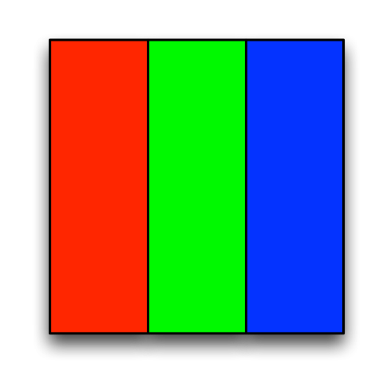
 
Uppritning i Processing sker genom att anropa funktioner som färglägger bildskärmspunkterna, så att det ser ut som linjer, cirklar och rektanglar. 

När ett Processing program startas, öppnas ett fönster på skärmen med den rityta vi kan använda. Storleken på fönstret styrs av funktionen size(). Följande kod säger till Processing att fönstret och ritytan skall vara 600 pixlar bred och 400 pixlar hög. 

    size(600, 400)

Kör man programmet i Processing visas följande fönster på skärmen:
 
Den gråa ytan är de pixlar vi kan använda att rita på med ritfunktionerna i Processing.

## Skärmkoordinatsystem

För att datorn skall veta var någonstans vi vill rita i fönstret måste vi kunna ange detta på något sätt. I Processing genom att använda ett s.k. koordinatsystem. Koordinatsystemet i Processing utgår från det övre högra hörnet. För att ange var man vill rita anger man först hur många pixlar från vänster sida i fönstret (x-koordinat), därefter anger man hur många pixlar från övre kanten i fönstret (y-koordinat). Nästa bild visar hur detta fungerar:

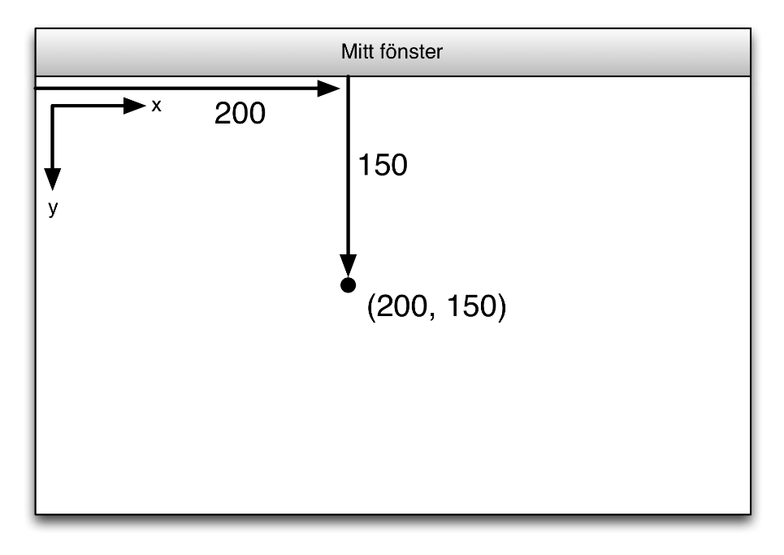

I figuren skall uppritning ske 200 pixlar från vänsterkanten och 150 pixlar från ovankanten. Detta mostvarar x-koordinaten 200 och y-koordinaten 150. Detta skriver man ofta som positionen (200, 150). Detta är också denna angivelse man använder i funktionerna i Processing. Följande kod ritar en linje från positionen (200, 150) till (400, 300).

    size(600,400)
    line(200,150,400,300)

Kör man koden visas följande fönster:

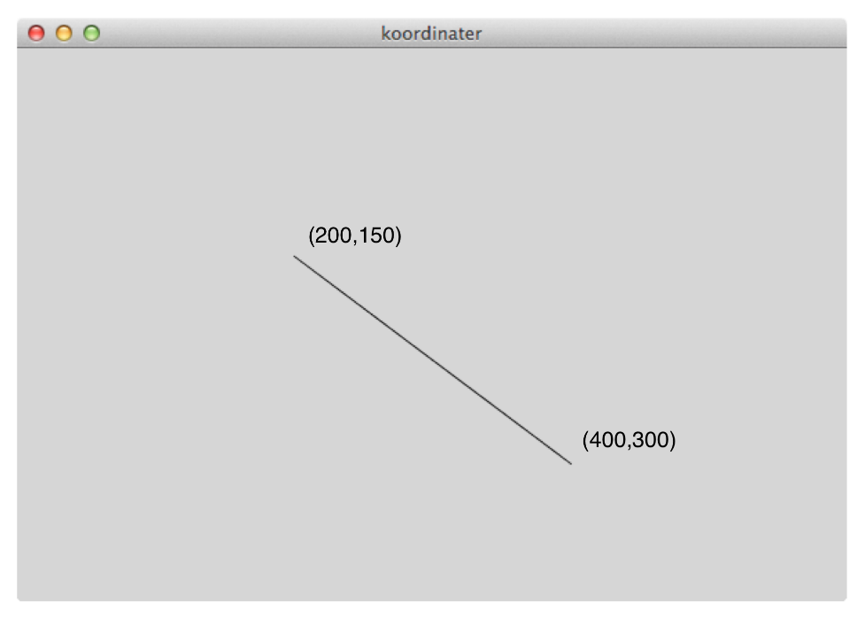

Fler linjer kan ritas upp genom att lägga till fler anrop till funktionen line. 

    size(600,400)
    line(200,150,400,300)
    line(400,150,200,300)

När denna kod körs i Processing visas följande fönster:

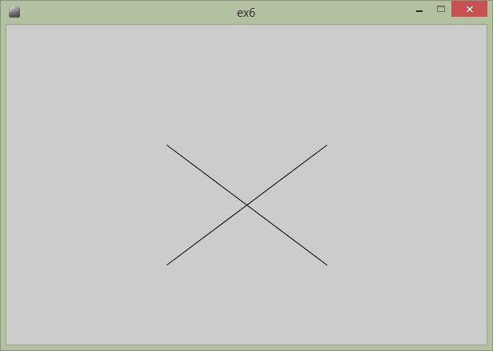

## Fler funktioner för uppritning

Det finns fler funktioner för uppritning i Processing. Följande lista beskriver några av dessa:

 * rect(x, y, bredd, höjd) - Rektangel
 * rect(x, y, bredd, höjd, radie) - Rektangel med rundade hörn
 * triangle(x1, y1, x2, y2, x3, y3) - Triangel med hörn i (x1, y2), (x2, y2) och (x3, y3)
 * quad(x1, y1, x2, y2, x3, y3, x4, y4) - Fyrhörning med hörn i (x1, y2), (x2, y2), (x3, y3) och (x4, y4)
 * ellipse(x, y, bredd, höjd) - Ellips

## Färg, linjetjocklek och andra egenskaper

Om inget anges kommer Processing rita upp figurerna med svarta linjer, vit fyllning på grå bakgrund. Dessa egenskaper går att ändra med hjälp funktioner in Processing. Bakgrundsfärgen i Processing-fönstret ändras t ex med funktionen background(…). Indata till funktionen är färgen som fönstrets bakgrund skall få. Anges bara ett värde sätts färgen i en skala från svart till vit, där 0 är svart och 255 vitt. Följande programkod skapar ett fönster med storleken (600,400) och med bakgrundsfärgen 64 (mörkgrå).

    size(600, 400)
    background(64)

Resultat av körning:

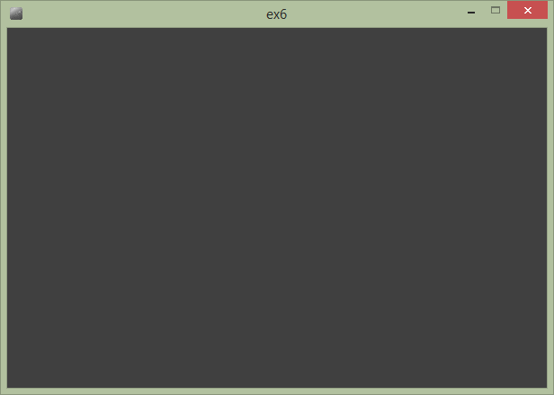

Ändras bakgrundsfärgen till 255 blir resultatet istället:

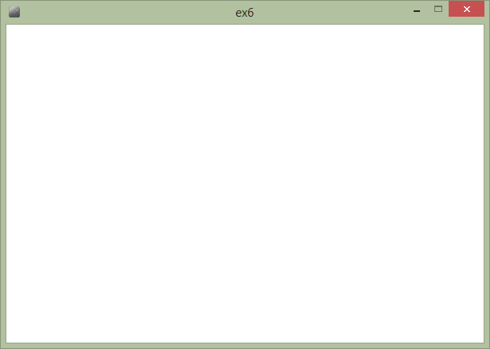

Färger kan också anges genom att ange en blandning av färgerna rött, grönt och blått. Till skillnad från när man blandar färg med penslar kan man jämföra blandning av färger i datorn med att blanda olika ljusstarka lampor. Om man lyser med 3 lampor i rött, grönt och blått uppfattas detta som vitt på långt avstånd. Jämför också med hur bildpunkterna på en datorskärm är uppbyggda av 3 st ”lampor” i rött, grönt och blått. Resultatet av att blanda de olika färgerna visas i följande bild:

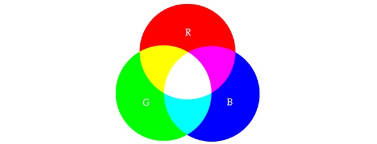

I de flesta funktioner i Processing där färg krävs anges denna ofta med 3 värden för rött, grönt och blått. 0 anger låg intensitet och 255 maximal intensitet på färgen. För att använda en gul bakgrund i Processing-fönstret anger man full intensitet, 255, för färgerna rött och grönt och minimal intensitet, 0, för färgen blå. Den tidigare koden blir då:

    size(600,400)
    background(255,255,0)

Resultat av körning:

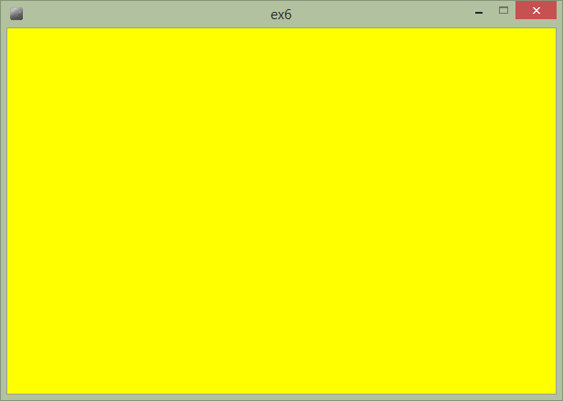

Andra egenskaper för uppritning kan också ändras med hjälp av funktioner. Linjernas färger styrs med hjälp av funktionen stroke(…). På samma sätt som funktionen background(…) väljs istället den färg som skall användas för uppritning av de geometriska figurerna. Färgen som sätts kommer att gälla för alla figurer som ritas upp fram till dess att stroke anropas igen. Följande exempel visar hur en rektangel och cirkel ritas upp med olika linjefärger.

    size(600,400)
    background(255,255,255)
    stroke(255,0,0)
    rect(50,50,150,150)
    stroke(0,0,255)
    ellipse(300,125,150,150)

Körning av koden ger följande resultat:

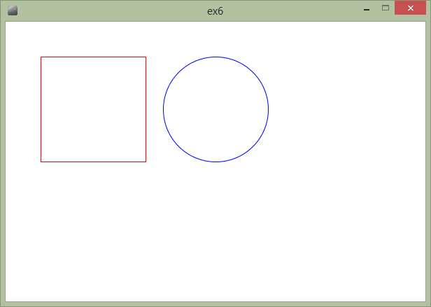

Färgen som används för att fylla figurerna kan ändras med funktionen fill(…). Färgen som sätts med funktionen gäller för alla figurer som ritas upp till dess att fill anropas med nya värden. Det föregående exemplet kompletteras nu med fill funktioner för att ändra fyllnadsfärgerna för kvadraten och cirkeln till gul och magenta:

    size(600,400)
    background(255,255,255)
    stroke(255,0,0)
    fill(255,255,0)
    rect(50,50,150,150)
    stroke(0,0,255)
    fill(255,0,255)
    ellipse(300,125,150,150)

Körning av exemplet ger:    

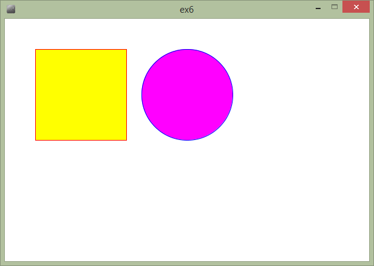

Det finns ytterligare egenskaper som kan vara bra att kunna ändra. Ibland vill man kanske rita en figur med bara fyllning, utan en linje runt figuren. Detta kan göras genom att anropa funktionen noStroke(). Denna funktion stänger av uppritningen av linjer kring figurer tills man anropar funktionen stroke(…) igen. Funktionen noFill() fungerar på samma sätt för figurernas fyllning. 

I det tidigare exemplet läggs nu in extra kod som ritar kvadraten utan linje och cirkeln utan fyllning:

    size(600,400)
    background(255,255,255)
    noStroke()
    fill(255,255,0)
    rect(50,50,150,150)
    stroke(0,0,255)
    noFill()
    ellipse(200,125,150,150)

Exemplet ger följande resultat när man kör det:

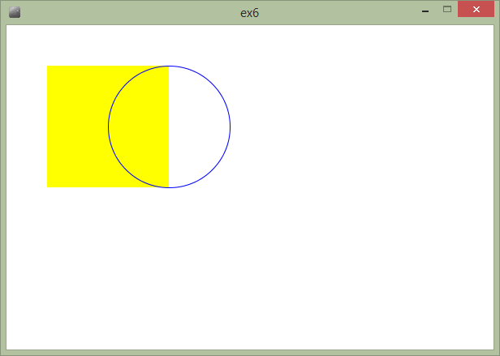

Vi kan se i fönstret att cirkeln nu ritas upp utan fyllning eftersom den gula fyllningen från kvadraten syns igenom cirkeln.

En annan figuregenskap som kan påverkas är tjockleken på linjerna i figurerna. För att ändra tjockleken för de uppritade linjerna används funktionen strokeWeight(…). Indata till funktionen är tjockleken i pixlar. I följande exempel ritas kvadraten och cirkeln upp igen med olika linjetjocklekar:

    size(600,400)
    background(255,255,255)
    strokeWeight(5)
    stroke(255,0,0)
    fill(255,255,0)
    rect(50,50,150,150)
    strokeWeight(10)
    stroke(0,0,255)
    fill(255,0,255)
    ellipse(300,125,150,150)

Programkörningen resulterar i följande fönster:

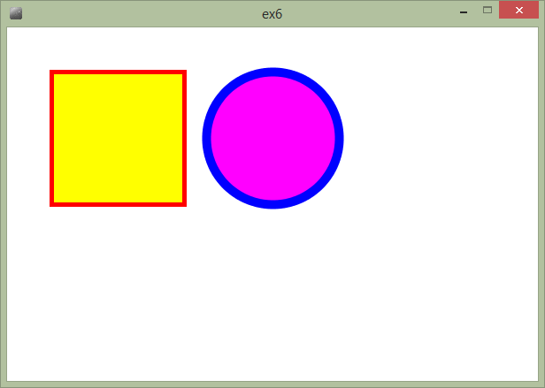

## Uppgift 1

Skapa ett program i Processing som ritar upp följande figur:

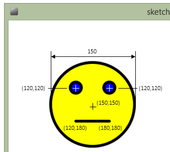

# Minne, lagring och variabler

I början av denna text pratade vi om hur datorn lagrar program och information i minnet. I program behöver vi också ofta lagra information, som t ex siffror, text och grafik i minnet för att kunna hämta tillbaka det när vi behöver det. I de tidigare exemplen har vi angett siffror direkt till funktionerna. Många gånger har vi också angett samma siffra många gånger. För att förenkla hanteringen av information i program använder man sig av variabler. Variabler kan liknas vid en låda i en byrålåda med en etikett på. I lådan kan vi lägga olika saker. Etiketten gör det lätt att hitta sakerna i lådan igen. I datorns värld anger en variabel en plats i minnet. Namnet på variabeln är etiketten som gör att vi kan hitta tillbaka till denna minnesplats igen.

I Processing finns det ett antal olika typer av variabler:

 * int eller heltal	1, 2, 3, 4, 5
 * float eller decimaltal	1.5, 43.65, 0.1
 * String eller text	”Detta är en text”

En variabel i Processing (Python) skapas genom att ange namnet på variabeln följt av ett likhetstecken, =, och sedan värdet man vill att variabeln skall innehålla. 

I följande exempel skapar vi variabeln d för att ange cirklarnas diameter. Eftersom skärmen är uppdelad i hela pixlar anger vi denna som en heltalsvariabel:

    d = 100
    size(600,400)
    ellipse(50,50,d,d)
    ellipse(50+d,50,d,d)

Genom att använda en variabel förenklar vi uppritningen. Körs exemplet visas följande i fönstret:

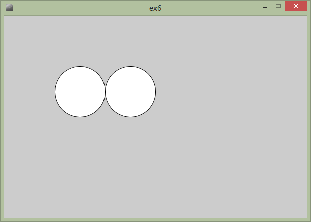

Genom att ändra variabelns värde till 200, ritas återigen 2 cirklar upp, men de är nu dubbelt så stora, men ligger fortfarande bredvid varandra. 

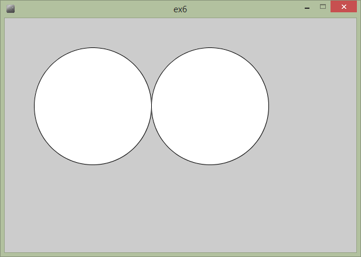

Det är alltså mycket enklare att ändra hur uppritningen skall göras genom att vi bara behöver ändra på ett ställe i koden.

I ett lite mer avancerat exempel vill vi rita upp följande figurer:

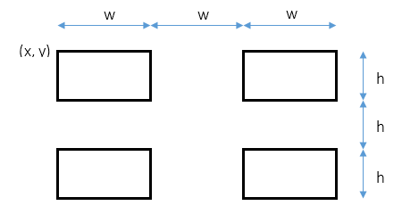

I detta exempel behöver vi 4 st variabler x, y, w och h. I Processing blir koden då:

    size(600,400)

    w = 100
    h = 50
    x = 50
    y = 50

    rect(x, y, w, h)
    rect(x + 2*w, y, w, h)
    rect(x, y + 2*h, w, h)
    rect(x + 2*w, y + 2*h, w, h)

Körs koden visas följande fönster:    

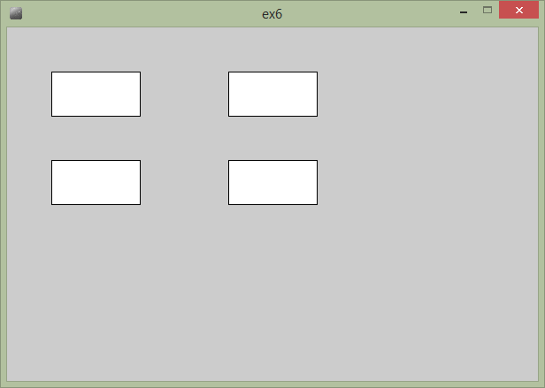

Genom att ändra variablerna till x = 100, y = 50, w = 50 och h = 100, fås enkelt nu föjande fönster istället:

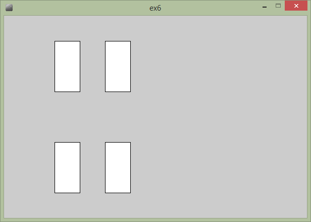

## Uppgift 2

Ändra koden för uppritning av rektanglarna så den istället ritar cirklar med diametern 50. Ersätt variablerna w och h med variabeln d som skall lagra diametern. Ändra anropen av rect(…) funktionen till anrop av funktionen ellipse(…). Byt ut w och h i anropen till variabeln d.

Körningen av programmet skall visa följande fönster på skärmen:

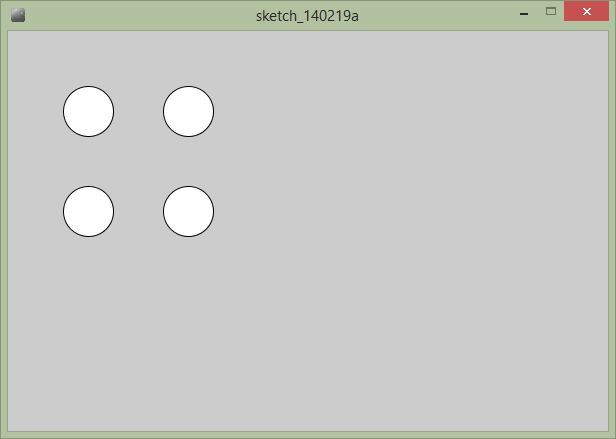

# Upprepning och slumptal

## for-satsen

När man programmerar råkar man ofta ut för situationer där man måste anropa funktioner många gånger. För att förenklar och effektivisera detta kan man använda sig av s.k. loopar. Loopar upprepar ett antal funktionsanrop ett visst antal gånger eller oändligt många gånger.

I Processing skapar man en loop med en for-satsen, vilken konstrueras på följande sätt:

    size(600, 400)
    
    d = 50
    y = 100
    
    for x in range(80, 400, 2*d): 
        ellipse(x, y, d, d)

80 anger startvärde för x i for-loopen. 400 anger stoppvärde som anger när loopen skall avbrytas. x kommer att få värdena 80, 180, 280, 380. Kör man programmet får man följande bild:

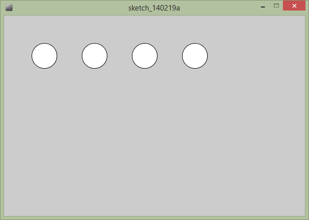

Vi kan också använda loopar inuti andra loopar. Om vi t ex vill rita upp 4 x 4 cirklar på skärmen kan vi skriva följande kod:

    size(500,500)

    d = 50
    x = 80
    y = 80

    for x in range(80, 400, 2*d): 
        for y in range(80, 400, 2*d):
            ellipse(x, y, d, d)

Kör vi programmet visas nu 16 cirklar:

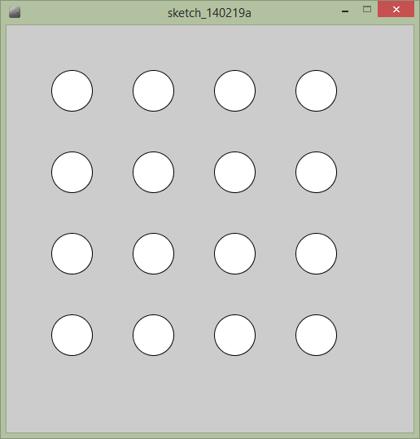

## Slumptal

Något datorn är bra på är faktiskt att kasta tärning. Resultatet av tärningskasten i datorn kallas för slumptal. Dessa kan användas för att placera ut monster i labyrinter eller rita upp intressanta mönster på skärmen. För att skapa slumptal i Processing används funktionen random(…). Indata till funktionen anger det högsta slumptalet som skall skapas. Genom att kombinera loopar och slumptal kan vi skapa intressanta ”konstverk”:

    size(500,500)

    d = 50
    x = 80
    y = 80

    for i in range(300):
        x = random(400)
        y = random(400)
        ellipse(x+50, y+50, d, d)

Vi använder en loop som upprepas 300 gånger. Variabeln i används här bara för att hålla koll på hur många upprepningar som skall utföras.

I följande skapar vi 2 st slumptal för cirkelns position, x och y. Dessa använder vi sedan när vi ritar upp våra cirklar och får nu följande intressanta konstverk:

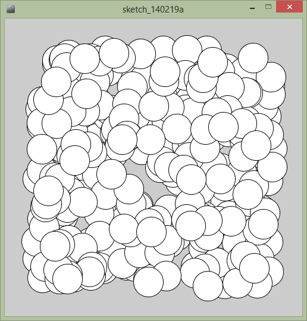

## Uppgift 3

Ändra konstverket till att rita upp 300 slumpmässigt färglagda cirklar. Cirklarnas storlek skall också sättas till slumpvärden. Funktionen random(…) kan också skapa ett slumptal mellan två värden genom att som indata ge 2 värden t ex, random(10,50), vilket skapar slumptal mellan 10 och 50. En slumpmässig fyllfärg kan skapas med:

    fill(random(255), random(255), random(255))

Om programmet fungerar kan de se ut som i nedanstående fönster:

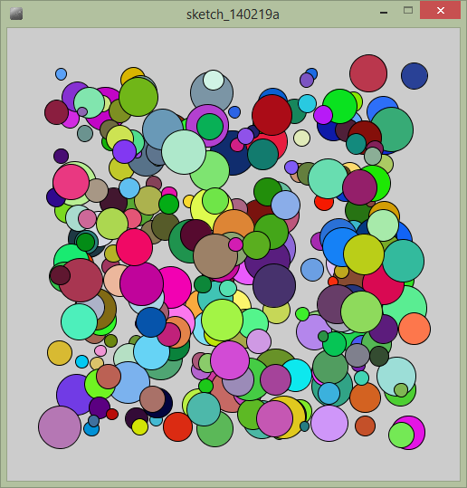

# Interaktivitet

## Speciella funktioner i Processing

Fram till nu har vi använt Processing i ett speciellt läge där det inmatade programmen kör och sedan avslutas. Det finns ingen möjlighet att i detta läge skapa interaktion och rörlig grafik. Det går inte heller att skapa egna funktioner. För att lösa detta måste man skriva programmen på ett annat sätt. Dessa program bygger på att man skriver 2 egna funktioner, setup(), och draw(). setup(…) anropas av Processing en gång när programmet startas. Denna funktion kan användas för att tilldela värden till variabler och sätta storleken på fönstret. draw(…) anropas hela tiden av Processing och i denna placeras den kod som utför uppritning i fönstret. 

I det följande exemplet har det tidigare exemplet som ritar 16 st cirklar modifierats till att använda de speciella funktionerna setup(…) och draw(…).

    # Variabler som skall vara tillgängliga
    # för alla funktioner i programmet.

    d = 50;
    x = 80;
    y = 80;

    # setup() anropas en gång när programmet startats.
    def setup():
        size(500,500)

    # draw() anropas av Processing hela tiden
    def draw():
        background(192)
        for x in range(80, 400, 2*d): 
            for y in range(80, 400, 2*d):
                ellipse(x, y, d, d)

Körs detta program uppför det sig precis som innan. Lägg märke till funktionen background(192). På grund av att draw() anropas hela tiden är det viktigt att rensa bakgrunden mellan anropen.

## Använda musen

Det finns ett antal fördefinierade variabler i Processing för olika ändamål. Om man vill veta var muspekaren befinner sig i fönstret finns variablerna mouseX och mouseY. I följande exempel använder vi dessa variabler för att hela tiden rita en cirkel där muspekaren befinner sig:

    # Variabler som skall vara tillgängliga
    # för alla funktioner i programmet.

    d = 50
    x = 80
    y = 80

    # setup() anropas en gång när programmet startats.
    
    def setup():
        size(500,500)

    # draw() anropas av Processing hela tiden
    
    def draw():
        background(192)
        fill(255,255,0)
        strokeWeight(3)
        stroke(0)
        ellipse(mouseX, mouseY, 20, 20)

När programmet körs visas följande på skärmen:

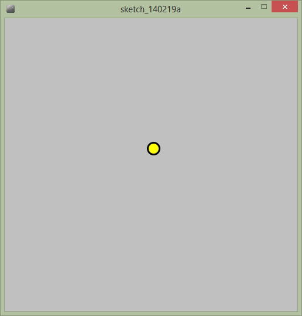

Det finns 2 andra musvariabler också, pmouseX och pmouseY dessa anger muspekarens position för tidigare anropet till draw(). Det är kanske lite svårt att förklara, men i det följande exemplet används alla dessa variabler för att skapa ett enkelt ritprogram.

    # Variabler som skall vara tillgängliga
    # för alla funktioner i programmet.

    d = 50
    x = 80
    y = 80

    # setup() anropas en gång när programmet startats.
    
    def setup():
        background(192)
        size(500,500); 
    
    # draw() anropas av Processing hela tiden

    def draw():
        strokeWeight(3)
        stroke(0)
        line(pmouseX, pmouseY, mouseX, mouseY)

För att inte tidigare linjer skall suddas ut flyttas background() funktionen till setup() istället. Nedanstående bild visar hur programmet fungerar:

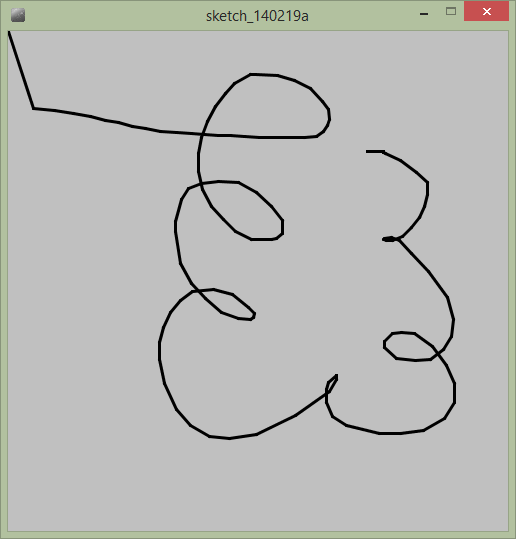

# Villkor eller if-satser

Något som är mycket viktigt när man utvecklar program är möjligheten att utföra olika funktioner beroende på vad värdet är på olika variabler eller funktioner. I Processing kan man göra detta med den s.k. if-satsen. Den enklaste formen av If-sats har följande uppbyggnad:

    if (villkor):
        # Rutiner som placeras här utförs om villkoret är uppfyllt

Den finns också en variant på if-satsen där man kan utföra funktioner både när villkoret är uppfyllt och när det inte är uppfyllt.

    if (villkor):
        # Rutiner som placeras här utförs om villkoret är uppfyllt
    else:
        # Rutiner som placeras här utförs om villkoret inte är uppfyllt
    
If-satsen illustreras bäst genom att använda den fördefinierade variabeln mousePressed. Denna variabel är av typen bool och kan endast inntehålla sant (true) eller falskt (false). När musknappen är nedtryckt är variabeln true i annat fall är den false. Med hjälp av detta kan vi faktiskt skapa ett komplett ritprogram i Processing:

    # Variabler som skall vara tillgängliga
    # för alla funktioner i programmet.

    d = 50
    x = 80
    y = 80

    # setup() anropas en gång när programmet startats.

    def setup():
        background(192)
        size(500,500) 
    
    # draw() anropas av Processing hela tiden

    def draw():
        strokeWeight(3)
        stroke(0)
        if mousePressed:
            line(pmouseX, pmouseY, mouseX, mouseY)

Det finns en annan fördefinierad variabel i Processing för att ta reda på vilken av musknapparna som är nedtryckt, mouseButton. Denna kan vi använda för att enkelt kunna radera det vi redan har ritat. Variabeln kan ha värdena **LEFT**, **RIGHT** och **MIDDLE**. Vi kan då enkelt modifiera vårt program för att hantera detta.

    # Variabler som skall vara tillgängliga
    # för alla funktioner i programmet.

    d = 50;
    x = 80
    y = 80

    # setup() anropas en gång när programmet startats.

    def setup():
        background(192)
        size(500,500)

    # draw() anropas av Processing hela tiden

    def draw():
        strokeWeight(3)
        stroke(0)
        if mousePressed:
            if mouseButton == LEFT:
                line(pmouseX, pmouseY, mouseX, mouseY);
            else:
                background(192)

# Egna funktioner

I de tidigare exemplen har vi använt funktioner för att utföra uppritning, ändra tjocklek på linjer och ändra storleken på fönstret. Det är också möjligt i Processing att skapa egna funktioner. En funktion i Processing har följande uppbyggnad:

    #  def är en instruktion som talar om att vi vill påbörja en funktion
    #  ansikte är funktionens namn
    #  (x, y) är funktionens indata
    #  : anger när funktionen börjar

    def ansikte(x, y):
        ellipse(x, y, 150, 150) # funktioner som utförs när funktionen
                                # anropas

Som ett exempel skulle vi kunna skapa en funktion som ritar upp vår gula gubbe. Indata till funktionen är den position vi vill att den skall ritas upp i. 

    # Egen funktion för uppritning av ansikte.
    
    def ansikte(x, y):
        strokeWeight(5)
        stroke(0,0,0)
        fill(255,255,0)
        ellipse(x,y,150,150)
        fill(0,0,255)
        ellipse(x-30,y-30,20,20)
        ellipse(x+30,y-30,20,20)
        line(x-30,y+30,x+30,y+30)

    # setup() anropas en gång när programmet startats.

    def setup():
        background(192)
        size(500,500)
        stroke(0)

    # draw() anropas av Processing hela tiden

    def draw():
        background(192)
        ansikte(mouseX, mouseY)

Kör man programmet kommer vårt ”ansikte” ritas upp under muspekaren:

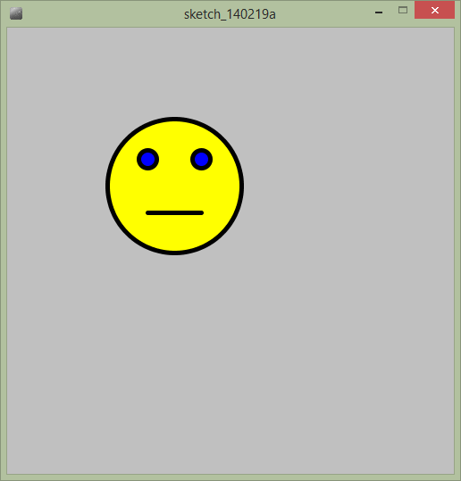

## Uppgift 4

Processing har också fördefinierade variabler för att hantera tangentbordsinmatning. **keyPressed** är *True* om en tangent är nedtryckt. För att ta reda på vilken tangent som är nedtryckt kan variabeln key användas. Med hjälp av detta modifiera ritprogrammet, så att man kan rita med röd färg när man trycker 1, grön färg om man trycker 2, blå färg om man trycker 3 och svart om man trycker 0.

Tips: För att testa vilken tangent som är nedtryckt kan följande if-sats användas:

    if key == '1'):
        stroke(255,0,0)
